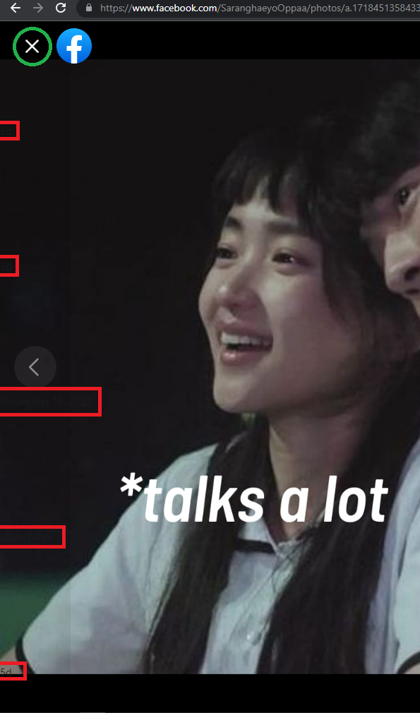

# FBx

<!-- PROJECT LOGO -->
 

  

  <h3 align="center">FBx</h3>

A simple Google Chrome extension that fixes Facebook close button bug.

 

## How to install
1. Download the <a href="https://github.com/AlecBlance/FBx/releases/download/v1.0/Fbx.crx"> FBx extension </a>
2. Go to Google Chrome's Settings - icon > Tools > Extensions 
3. Enable Developer Mode ( toggle button in top-right corner )
4. Drag and drop the downloaded FBx extension file onto the Extensions page from step 2 
5. Install

## Bug Sample
The texts (red boxes) are present and the close button (green circle) cannot be clicked. This is because the parent element of the texts (red boxes) is on top of the close button. So instead of closing, it will redirect you to a different page. 
 
 

## How to reproduce
1. Go to your facebook newsfeed
2. Scroll all the way down and load multiple posts
3. Click any photo or video you found below after you scolled

